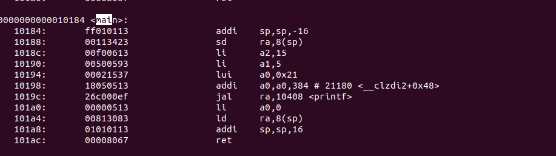
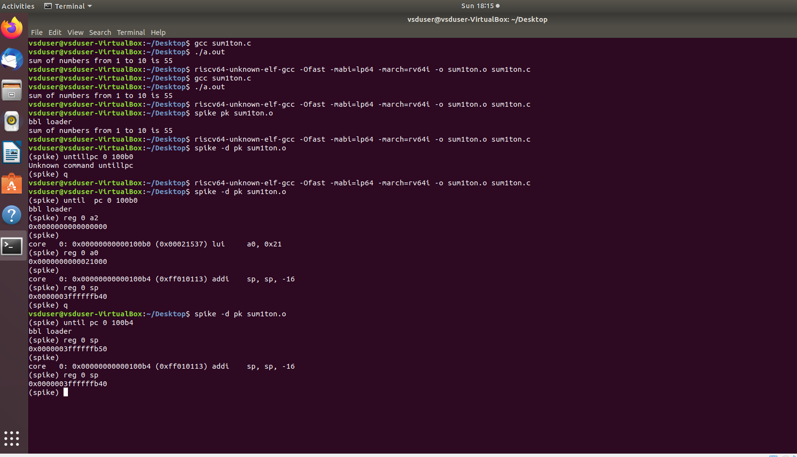
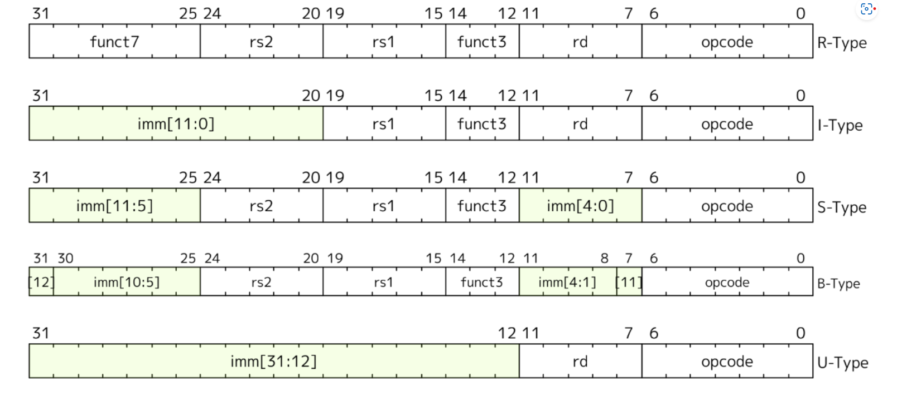
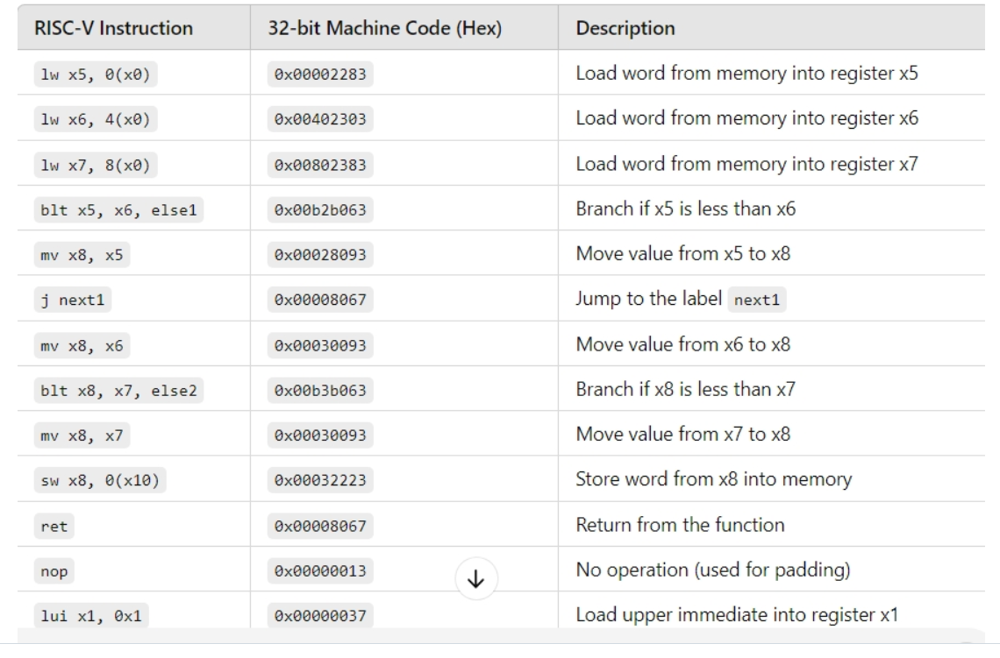
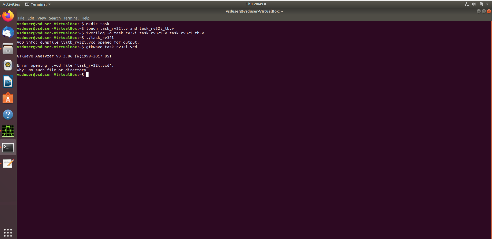
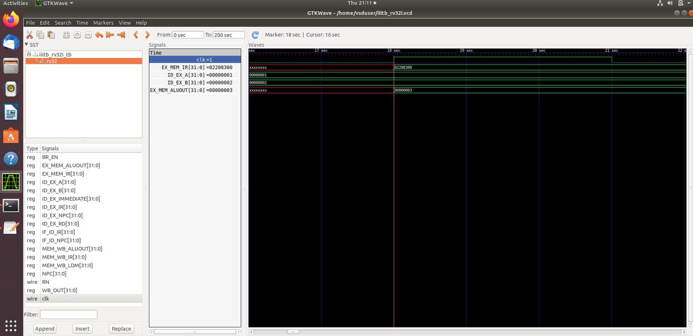
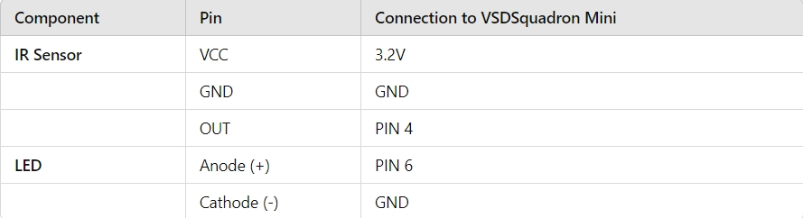

 # VSDSquadronMini Research Internship - 20th October Cohert
 
<h2>The program is based on RISC-V architecture and uses open-source tools to teach people about VLSI and RISC-V</h2><br>

### Instructor: Kunal Ghosh
### Student Name: Monika T N</li>
### College Name:BMS COLLEGE OF ENGINEERING,BENGALURU.

<details>
 <summary>
 <h2> TASK-1 </h2> 
<h3>Installation of RISC-V toolchain using VDI. Uploading the snapshot of complied code and RISC-V Objdmp on GitHub.</h3>
 </summary>
The task 1 includes completion of the following instructions
<br>
<ol>
  <li> Creating GitHub repo. </li>
  <li> Installation of Oracle VirtualBox. </li>
  <li> Installation of RISC-V toolchain using VDI. </li>
  <li> Writing C program to find sum of n numbers. </li>
  <li> Using RISC-V Simulator for compiling and running the code. </li>
  <li> Uploading the snapshots in Github. </li>
</ol>
<h4>
  STEPS:
  <br>
  <OL>
    <li>
      Open ubuntu in VirtualBox.
    </li>
   
      
   <br>
      <li>Home screen of Ubuntu.</li>
      
    <br>
      <li>Write the C program for sum of one to n in newfile and run the code in terminal.</li>
       <br>
      <li>Run command riscv64-unknown-elf-objdump -d sum1ton.o </li>
       <br>
      <li>Search the main.</li>
       
        
</OL>
</h4>
</details>

-------------------------------------------------

<details>
<summary>
 <h2>TASK-2</h2>
</b> <h3>Performing SPIKE Simulation and Debugging a simple C code with Interactive Debugging Mode using Spike</h3>
</summary> 
  
### What is SPIKE in RISCV?
> * A RISC-V ISA is a simulator, enabling the testing and analysis of RISC-V programs without the need for actual hardware.  
> * Spike is a free, open-source C++ simulator for the RISC-V ISA that models a RISC-V core and cache system. It can be used to run programs and a Linux kernel, and can be a starting point for running software on a RISC-V target.  
  
 ### What is pk (Proxy Kernel)?  
> * The RISC-V Proxy Kernel, pk , is a lightweight application execution environment that can host statically-linked RISC-V ELF binaries.  
> * A Proxy Kernel in the RISC-V ecosystem simplifies the interaction between complex hardware and the software running on it, making it easier to manage, test, and develop software and hardware projects.  
 


### Testing the SPIKE Simulator  
The target is to run the ```sum1ton.c``` code using both ```gcc compiler``` and ```riscv compiler```, and both of the compiler must display the same output on the terminal. 

### Debug the task 1 code using SPIKE
<li> To use SPIKE and debug sum 1 to n c program </li><br>




### Write a simple C program for any simple application and compile with RISC-V GCC/SPIKE.
<li>Write the C program to find largest number in 3 numbers in newfile and run the code in terminal.</li>
<br>

<li>And to compile the code using **riscv compiler**, use the following command: </li><br>
<br>
<li>Search the main.</li>
       
        
 
</details>

-----------------------------------------------
<details>
<summary>
 <h2>TASK-3</h2><br>
 
</b><h3> 1.RISC-V Instruction types & 32-Bit Instruction code.<br>
 2.Identifying 15 unique RISC-V instructions from Max_Min_Detector.o Assembly Code along with the 32-Bit Instruction Code.<br>
 3.Exact 32-bit instruction code in the instruction type format for 15 unique instructions.</h3>
</summary>

<h3>What is RISC-V?</h3>
<p>RISC-V is an exciting and innovative open-source instruction set architecture (ISA) that enables developers to create custom processors tailored to specific applications. This means that anyone can design and implement their processors without needing to pay for expensive licenses, making RISC-V a popular choice in both academia and industry.</p>


<h2>Instruction Formats in RISC-V</h2>
RISC-V organizes its machine language instructions into six distinct formats, each optimized for different types of operations. Here’s a breakdown of each format:

<h3>R-Type Instructions:</h3>

<p>Used primarily for arithmetic and logical operations.Each instruction is 32 bits long and includes.<br>
 Structure:
<li>Opcode (7 bits): Indicates the type of operation.</li>
<li>rd (5 bits): The destination register where the result is stored.</li>
<li>func3 (3 bits): Specifies the operation type (e.g., add, subtract).</li>
<li>rs1 (5 bits): The first source register.</li>
<li>rs2 (5 bits): The second source register.</li>
<li>func7 (7 bits): Provides additional details about the operation.</li></p>

<h3>I-Type Instructions:</h3>
Involves operations that use registers and immediate values (constants).<br>
Structure:
<li>Opcode (7 bits): Identifies the instruction type.</li>
<li>rd (5 bits): The destination register.</li>
<li>func3 (3 bits): Operation type.</li>
<li>rs1 (5 bits): The source register.</li>
<li>imm (12 bits): A signed immediate value (replaces rs2 and func7 from R-Type).</li>

<h3>S-Type Instructions:</h3>
Used to store data from registers to memory.<br>
Structure:
<li>Opcode (7 bits): Indicates the operation.</li>
<li>imm (12 bits): Split into two parts for memory address calculation.</li>
<li>rs1 (5 bits): The source register containing the value to be stored.</li>
<li>func3 (3 bits): Defines the type of store operation (byte, half-word, etc.).</li>

<h3>B-Type Instructions:</h3>
Used for branching and control flow based on conditions.<br>
Structure:
<li>Opcode (7 bits): Defines the instruction type.</li>
<li>imm (12 bits): Encodes the branch offset.</li>
<li>rs1 (5 bits) and rs2 (5 bits): Source registers used in the branching condition.</li>
<li>func3 (3 bits): Specifies the branch condition.</li>

<h3>U-Type Instructions:</h3>
Designed to load immediate values into registers.<br>
Structure:
<li>Opcode (7 bits): Specifies the instruction.</li>
Consists mainly of two instructions: LUI (Load Upper Immediate) and AUIPC (Add Upper Immediate to PC).
Example: lui x15, 0x13579 would load the value into the upper half of register x15.

<h3>J-Type Instructions:</h3>
It is used for jump operations, allowing the program to change its execution flow.<br>
Structure:
<li>Opcode (7 bits): Indicates a jump instruction.</li>
<li>imm (20 bits): The immediate value determining where to jump.</li>
Primarily consists of the JAL (Jump and Link) instruction, often used in loops and function calls.<br>

<h2>15 unique RISC-V instructions from Max_Min_Detector.o Assembly Code along with the 32-Bit Instruction Code.</h2><br>

<h2>Exact 32-bit instruction code in the instruction type format for 15 unique instructions.</h2>


### 1. `lw x5, 0(x0)`  
   - **Instruction Type:** I-Type  
   - **Operation:** Load word from memory.  
   - **Details:**  
     - This instruction loads a 32-bit word from memory at the address specified by `x0 + 0` (which is typically `0` because `x0` in RISC-V is hardwired to zero).
     - The value from this memory location is loaded into the register `x5`.  
   - **Role in Program:**  
     - This is the first memory load operation and sets the value of `x5`.

---

### 2. `lw x6, 4(x0)`  
   - **Instruction Type:** I-Type  
   - **Operation:** Load word from memory.  
   - **Details:**  
     - Similar to the first instruction, but here it loads a word from an address offset by 4 bytes from the base address in `x0` (0 in this case).  
     - This value is loaded into register `x6`.
   - **Role in Program:**  
     - This instruction sets the value of `x6` from memory.

---

### 3. `lw x7, 8(x0)`  
   - **Instruction Type:** I-Type  
   - **Operation:** Load word from memory.  
   - **Details:**  
     - This instruction loads the word from the memory address `x0 + 8` and stores it into register `x7`.  
   - **Role in Program:**  
     - This instruction sets the value of `x7`.

---

### 4. `blt x5, x6, else1`  
   - **Instruction Type:** B-Type  
   - **Operation:** Branch if less than.  
   - **Details:**  
     - This is a conditional branch instruction.
     - It compares `x5` and `x6`. If the value in `x5` is less than the value in `x6`, the program branches to the label `else1`. If not, it continues with the next instruction.
   - **Role in Program:**  
     - This instruction controls the program flow by branching based on a comparison. It introduces the decision-making part of the program.

---

### 5. `mv x8, x5` (encoded as `addi x8, x5, 0`)  
   - **Instruction Type:** I-Type  
   - **Operation:** Move (implemented as `addi` with immediate 0).  
   - **Details:**  
     - The `mv` (move) instruction copies the value from `x5` to `x8`. It’s encoded as `addi x8, x5, 0`, which adds 0 to `x5` and stores the result in `x8`.  
   - **Role in Program:**  
     - This instruction is used to copy the value of `x5` into `x8`. If the program didn’t branch at `blt`, this would be the next step.

---

### 6. `j next1`  
   - **Instruction Type:** J-Type  
   - **Operation:** Jump to label.  
   - **Details:**  
     - This unconditional jump moves program execution to the label `next1`, skipping over any instructions between the current one and `next1`.
   - **Role in Program:**  
     - It skips some instructions (likely the `else1` block) and moves execution forward.

---

### 7. `mv x8, x6` (encoded as `addi x8, x6, 0`)  
   - **Instruction Type:** I-Type  
   - **Operation:** Move (implemented as `addi` with immediate 0).  
   - **Details:**  
     - Copies the value from `x6` to `x8`, similar to the earlier `mv` instruction, but now with the value of `x6`.  
   - **Role in Program:**  
     - This happens if the program took the `else1` branch, updating `x8` with the value from `x6`.

---

### 8. `blt x8, x7, else2`  
   - **Instruction Type:** B-Type  
   - **Operation:** Branch if less than.  
   - **Details:**  
     - This compares the value in `x8` with `x7`. If `x8` is less than `x7`, the program branches to `else2`. Otherwise, it continues with the next instruction.
   - **Role in Program:**  
     - Controls the flow based on another comparison. This adds another decision point in the program.

---

### 9. `mv x8, x7` (encoded as `addi x8, x7, 0`)  
   - **Instruction Type:** I-Type  
   - **Operation:** Move (implemented as `addi` with immediate 0).  
   - **Details:**  
     - Copies the value from `x7` to `x8`.  
   - **Role in Program:**  
     - If the program didn’t branch to `else2`, it moves the value of `x7` to `x8`.

---

### 10. `sw x8, 0(x10)`  
   - **Instruction Type:** S-Type  
   - **Operation:** Store word to memory.  
   - **Details:**  
     - This instruction stores the word from register `x8` into memory at the address `x10 + 0`.
   - **Role in Program:**  
     - It writes the result of the computation back to memory.

---

### 11. `ret` (encoded as `jalr x0, 0(x1)`)  
   - **Instruction Type:** I-Type (for indirect jumps).  
   - **Operation:** Return from subroutine.  
   - **Details:**  
     - This is a return instruction. It jumps back to the address stored in `x1` (typically the return address of a subroutine).
   - **Role in Program:**  
     - It ends the current function or subroutine and returns control to the calling program.

---

### 12. `nop` (encoded as `addi x0, x0, 0`)  
   - **Instruction Type:** I-Type  
   - **Operation:** No operation.  
   - **Details:**  
     - A `nop` (no operation) is a placeholder instruction that does nothing. It is encoded as `addi x0, x0, 0` which adds 0 to register `x0` (which remains 0).
   - **Role in Program:**  
     - It introduces a delay or alignment in instruction execution without affecting program state.

---

### 13. `lui x1, 0x1`  
   - **Instruction Type:** U-Type  
   - **Operation:** Load upper immediate.  
   - **Details:**  
     - This instruction loads the immediate value `0x1` into the upper 20 bits of register `x1`. The lower 12 bits are set to 0.  
   - **Role in Program:**  
     - It sets up `x1` with a high immediate value for future operations.

---

### 14. `addi x10, x0, 4`  
   - **Instruction Type:** I-Type  
   - **Operation:** Add immediate.  
   - **Details:**  
     - Adds the immediate value `4` to `x0` (which is 0) and stores the result (`4`) in `x10`.  
   - **Role in Program:**  
     - It sets `x10` to 4, possibly for future memory address calculations or comparisons.

---
</details>

------------------------------------------------------------------------
<details>
 <summary>
  <h2> </b>Task-4</h2>
  <h3>Use this RISC-V Core Verilog netlist and testbench for functional simulation experiment and Upload waveform</h3>
  </summary>
  ***NOTE:** Since the designing of RISCV Architecture and writing it's testbench is not the part of this Research Internship, so we will use the Verilog Code and Testbench of RISCV that has already been designed. The reference GitHub repository is : [iiitb_rv32i](https://github.com/vinayrayapati/rv32i/)***


### Steps to perform functional simulation of RISCV  
1. Create a new directory  ```mkdir <task>```
2. Create two files by using ```touch``` command as ```task_rv32i.v``` and ```task_rv32i_tb.v```<br>
  <br>

3. Copy the code from the reference github repo and paste it in your verilog and testbench files.<br>
  <br>
    <br>


  
  
4. To run and simulate the verilog code, enter the following command:  
	```
	$ iverilog -o task_rv32i task_rv32i.v task_rv32i_tb.v
	$ ./task_rv32i
	```
5. To see the simulation waveform in GTKWave, enter the following command:
	```
	$ gtkwave task_rv32i.vcd
	```

6. The GTKWave will be opened and following window will be appeared.<br>
     

7.Output Waveform of various instructions that we have covered in TASK-2.<br>
 <br>
  <br>
</details>

------------------------------------------------------------------------
  <details>
	  <summary>
		  <h2>TASK-5</h2><br>
		  <h3>MINI PROJECT</h3>
		  </summary>
<h2>Implementing Automatic Light System Using VSDSquadron Mini</h2>


<h3> Overview:</h3>
<p>This project involves creating an automatic lighting system that responds to motion, utilizing the VSDSquadron Mini board, an IR sensor, and LEDs. The system is designed to turn lights on when movement is detected and off when no movement is present, enhancing energy efficiency and convenience.</p><br>

<h3>Components:</h3>
<li><b>VSDSquadron Mini Board:</b> This microcontroller serves as the core unit that processes sensor input and controls the output to the lights via its GPIO pins.</li>
<li><b>IR Sensor:</b> It detects movement in the environment. When motion is detected, the sensor signals the VSDSquadron mini to activate the lights.</li>
<li><b>LEDs:</b> Used to represent the lighting system. These LEDs are connected to the GPIO pins of the VSDSquadron mini and are turned on or off depending on the IR sensor’s input.</li>
<li><b>Breadboard and Jumper Wires:</b> These components help in making connections between the sensor, microcontroller, and LEDs for easy prototyping.</li><br>
<h3>Functionality:</h3>
The IR sensor continuously monitors the environment for motion. When it detects movement, it sends a HIGH signal to the VSDSquadron mini via a GPIO pin.
The VSDSquadron mini, in turn, triggers the LEDs to switch on, simulating the activation of lights.
After a predetermined delay (e.g., 10-15 seconds), the LEDs turn off if no further motion is detected.
The system resets, ready to respond to the next motion event.<br>

<h3>Hardware connections:</h3>
<h4>PIN diagram.</h4>
<li><b>VSDSquadron Mini</b></li>
<b>Power:</b>
The board is powered via the USB connection to your computer or an external power source.
<li><b>GPIO Pins:</b></li>
GPIO Pin 1 → IR Sensor (OUT)<br>
GPIO Pin 2 → LED (with resistor)<br>
GPIO Pin 3 → Additional LED (optional for more lights)<br>
<li><b>IR Sensor</b></li>
VCC → 3.3V (from the VSDSquadron mini)<br>
GND → Ground (GND on VSDSquadron mini)<br>
OUT → GPIO Pin 1 (Input to VSDSquadron mini)<br>
<li><b>LEDs</b></li>
Anode (long leg) → GPIO Pin 2 (via 220Ω resistor)<br>
Cathode (short leg) → Ground (GND on VSDSquadron mini)<br>
<br>

<h4>Pin connections to VSDSquadron Mini:</h4><br>
<br>

<h3> C Program Code for the Automatic Light System:</h3>

<pre><code>
//These include the necessary header files (ch32v00x.h and debug.h) for the CH32V microcontroller and debugging purposes.
#include <ch32v00x.h>
#include <debug.h>
//pin configuration
void GPIO_Config(void)
{
GPIO_InitTypeDef GPIO_InitStructure = {0}; //structure variable GPIO_InitStructure of type GPIO_InitTypeDef which is used for GPIO configuration.

RCC_APB2PeriphClockCmd(RCC_APB2Periph_GPIOD, ENABLE); // to Enable the clock for Port D
//pin 4 OUT PIN FOR IR SENSOR
GPIO_InitStructure.GPIO_Pin = GPIO_Pin_4 ; // Defines which Pin to configure
GPIO_InitStructure.GPIO_Mode = GPIO_Mode_IPU; // Defines Output Type
GPIO_Init(GPIOD, &GPIO_InitStructure);
//pin 6 IS LED PIN
GPIO_InitStructure.GPIO_Pin = GPIO_Pin_6 ; //
GPIO_InitStructure.GPIO_Mode = GPIO_Mode_Out_PP; // Defines Output Type
GPIO_InitStructure.GPIO_Speed = GPIO_Speed_50MHz; // Defines speed

GPIO_Init(GPIOD, &GPIO_InitStructure);

}
//main function

int main(void)
{
uint8_t IR = 0;
uint8_t set=1;
uint8_t reset=0;
uint8_t a=0;
NVIC_PriorityGroupConfig(NVIC_PriorityGroup_2);// Configuring NVIC priority group
SystemCoreClockUpdate();// Update System Core Clock
Delay_Init();//Initialize Delay
GPIO_Config();//Call GPIO configuration function

while(1)
{
IR = GPIO_ReadInputDataBit(GPIOD, GPIO_Pin_4);
if (IR==1)//Read state of Pin 4 (IR sensor)
{ // for blinking of led three times upon motion detection
	for(a=0;a<3;a++){
GPIO_WriteBit(GPIOD, GPIO_Pin_6, set);
Delay_Ms(200);
GPIO_WriteBit(GPIOD, GPIO_Pin_6,reset);
Delay_Ms(100);}

}

}
}

</code>
</pre>
<h3>Applications:</h3>
<b>1.Smart Home Automation</b>:
<li>Application:</li> In a smart home, this system can be used to control room lighting, hallway lights, or outdoor lighting. Lights automatically turn on when a person enters the room and turn off after a specified delay when no motion is detected, helping reduce energy consumption.<br>
<li>Benefit:</li> This reduces electricity usage and ensures lights are not left on unnecessarily, improving overall energy efficiency.<br>
<b>2. Office and Commercial Spaces:</b>
<li>Application:</li> In office environments, meeting rooms, or hallways, the system can automatically turn on lights when someone enters and turn them off after they leave. This reduces the need for manual switching and ensures lights are only on when needed.<br>
<li>Benefit:</li> It can save energy costs and create a more user-friendly environment, where employees don’t need to manually adjust lights every time they enter or leave a room.<br>
<b>3. Security Lighting:</b>
<li>Application:</li> This system can be installed as part of an outdoor security lighting setup. When motion is detected (e.g., from an intruder or an animal), the lights will automatically turn on, illuminating the area and acting as a deterrent for unauthorized entry.<br>
<li>Benefit:</li> Increases security by activating lights in response to motion, alerting the homeowner or security personnel to any activity. It also reduces unnecessary lighting when no movement is detected.<br>
<b>4. Parking Lots and Garages:</b>
<li>Application:</li> For parking lots or garages, this system can turn on lights when a car or pedestrian enters the space and turn off after they leave. The system would reduce power consumption during the times the area is unoccupied.<br>
<li>Benefit:</li> Saves energy in large spaces and ensures lighting is only activated when necessary, improving safety in the area while being cost-effective.<br>
<b>5. Stairways and Hallways:</b>
<li>Application:</li> In stairways, corridors, or other areas with infrequent movement, this system ensures lights are automatically activated when someone is present and turns them off when not in use.<br>
<li>Benefit:</li> Enhances safety by providing lighting when needed and reduces energy waste by switching off when no movement is detected.


  </details>
 
 

