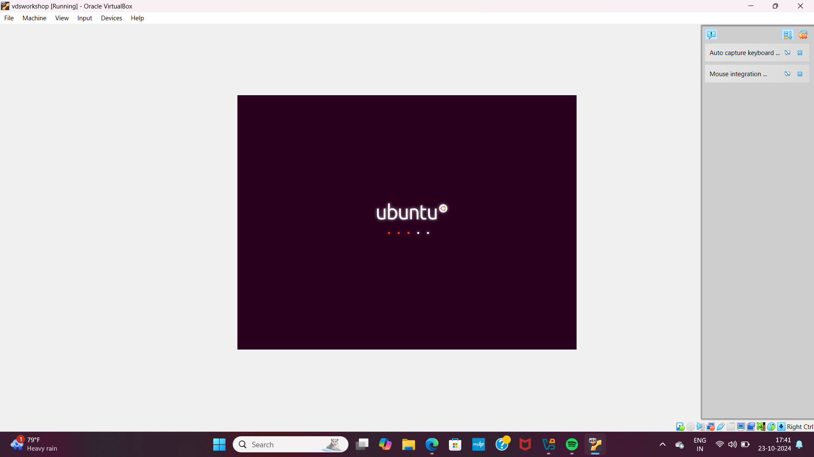
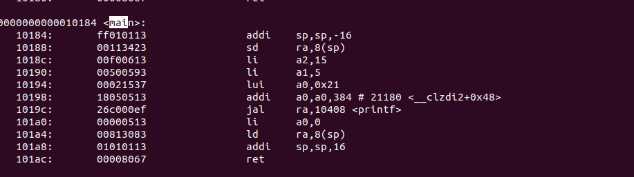

 # VSDSquadronMini Research Internship - 20th October Cohert
<p>
The program is based on RISC-V architecture and uses open-source tools to teach people about VLSI and RISC-V
</p>

<li>Instructor: Kunal Ghosh</li>
<li> Student Name: Monika T N</li>
<li> College Name:BMS COLLEGE OF ENGINEERIng</li></li>

<h2> TASK 1 </h2>
<h3> Installation of RISC-V toolchain using VDI. Uploading the snapshot of complied Ccode and RISC-V Objdmp on GitHub</h3>
The task 1 includes completion of the following instructions
<br>
<ol>
  <li> Creating GitHub repo. </li>
  <li> Installation of Oracle VirtualBox. </li>
  <li> Installation of RISC-V toolchain using VDI. </li>
  <li> Writing C program to find sum of n numbers. </li>
  <li> Using RISC-V Simulator for compiling and running the code. </li>
  <li> Uploading the snapshots in Github. </li>
</ol>
<h4>
  STEPS:
  <br>
  <OL>
    <li>
      Open ubuntu in VirtualBox.
    </li>
   
      
   <br>
      <li>Home screen of Ubuntu.</li>
      
    <br>
      <li>Write the C program for sum of one to n in newfile and run the code in terminal.</li>
       <br>
      <li>Run command riscv64-unknown-elf-objdump -d sum1ton.o </li>
       <br>
      <li>Search the main.</li>
       
        
</OL>
</h4>

-----------------------------------------------------------------------------------------------
<details>
<summary>
 <h3>Task2:</h3>
</b> <h2>Performing SPIKE Simulation and Debugging a simple C code with Interactive Debugging Mode using Spike</h2>
</summary> 
  
### What is SPIKE in RISCV?
> * A RISC-V ISA is a simulator, enabling the testing and analysis of RISC-V programs without the need for actual hardware.  
> * Spike is a free, open-source C++ simulator for the RISC-V ISA that models a RISC-V core and cache system. It can be used to run programs and a Linux kernel, and can be a starting point for running software on a RISC-V target.  
  
 ### What is pk (Proxy Kernel)?  
> * The RISC-V Proxy Kernel, pk , is a lightweight application execution environment that can host statically-linked RISC-V ELF binaries.  
> * A Proxy Kernel in the RISC-V ecosystem simplifies the interaction between complex hardware and the software running on it, making it easier to manage, test, and develop software and hardware projects.  
 


### Testing the SPIKE Simulator  
The target is to run the ```sum1ton.c``` code using both ```gcc compiler``` and ```riscv compiler```, and both of the compiler must display the same output on the terminal. 

### Debug the task 1 code using SPIKE
<li> To use SPIKE and debug sum 1 to n c program </li><br>


### Write a simple C program for any simple application and compile with RISC-V GCC/SPIKE.
<li>Write the C program to find largest number in 3 numbers in newfile and run the code in terminal.</li>
<br>

<li>And to compile the code using **riscv compiler**, use the following command: </li><br>
<br>
<li>Search the main.</li>
       
        
 
</details>

