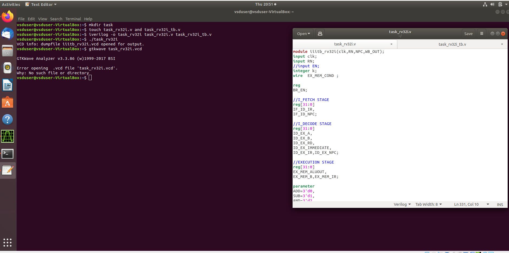

 # VSDSquadronMini Research Internship - 20th October Cohert
 
<h2>The program is based on RISC-V architecture and uses open-source tools to teach people about VLSI and RISC-V</h2><br>

### Instructor: Kunal Ghosh
### Student Name: Monika T N</li>
### College Name:BMS COLLEGE OF ENGINEERING,BENGALURU.

<details>
 <summary>
 <h2> TASK-1 </h2> 
<h3>Installation of RISC-V toolchain using VDI. Uploading the snapshot of complied code and RISC-V Objdmp on GitHub.</h3>
 </summary>
The task 1 includes completion of the following instructions
<br>
<ol>
  <li> Creating GitHub repo. </li>
  <li> Installation of Oracle VirtualBox. </li>
  <li> Installation of RISC-V toolchain using VDI. </li>
  <li> Writing C program to find sum of n numbers. </li>
  <li> Using RISC-V Simulator for compiling and running the code. </li>
  <li> Uploading the snapshots in Github. </li>
</ol>
<h4>
  STEPS:
  <br>
  <OL>
    <li>
      Open ubuntu in VirtualBox.
    </li>
   
      
   <br>
      <li>Home screen of Ubuntu.</li>
      
    <br>
      <li>Write the C program for sum of one to n in newfile and run the code in terminal.</li>
       <br>
      <li>Run command riscv64-unknown-elf-objdump -d sum1ton.o </li>
       <br>
      <li>Search the main.</li>
       
        
</OL>
</h4>
</details>

-------------------------------------------------

<details>
<summary>
 <h2>TASK-2</h2>
</b> <h3>Performing SPIKE Simulation and Debugging a simple C code with Interactive Debugging Mode using Spike</h3>
</summary> 
  
### What is SPIKE in RISCV?
> * A RISC-V ISA is a simulator, enabling the testing and analysis of RISC-V programs without the need for actual hardware.  
> * Spike is a free, open-source C++ simulator for the RISC-V ISA that models a RISC-V core and cache system. It can be used to run programs and a Linux kernel, and can be a starting point for running software on a RISC-V target.  
  
 ### What is pk (Proxy Kernel)?  
> * The RISC-V Proxy Kernel, pk , is a lightweight application execution environment that can host statically-linked RISC-V ELF binaries.  
> * A Proxy Kernel in the RISC-V ecosystem simplifies the interaction between complex hardware and the software running on it, making it easier to manage, test, and develop software and hardware projects.  
 


### Testing the SPIKE Simulator  
The target is to run the ```sum1ton.c``` code using both ```gcc compiler``` and ```riscv compiler```, and both of the compiler must display the same output on the terminal. 

### Debug the task 1 code using SPIKE
<li> To use SPIKE and debug sum 1 to n c program </li><br>


### Write a simple C program for any simple application and compile with RISC-V GCC/SPIKE.
<li>Write the C program to find largest number in 3 numbers in newfile and run the code in terminal.</li>
<br>

<li>And to compile the code using **riscv compiler**, use the following command: </li><br>
<br>
<li>Search the main.</li>
       
        
 
</details>

-----------------------------------------------
<details>
<summary>
 <h2>TASK-3</h2><br>
 
</b><h3> 1.RISC-V Instruction types & 32-Bit Instruction code.<br>
 2.Identifying 15 unique RISC-V instructions from Max_Min_Detector.o Assembly Code along with the 32-Bit Instruction Code.</h3>
</summary>

<h3>What is RISC-V?</h3>
<p>RISC-V is an exciting and innovative open-source instruction set architecture (ISA) that enables developers to create custom processors tailored to specific applications. This means that anyone can design and implement their processors without needing to pay for expensive licenses, making RISC-V a popular choice in both academia and industry.</p>


<h2>Instruction Formats in RISC-V</h2>
RISC-V organizes its machine language instructions into six distinct formats, each optimized for different types of operations. Here’s a breakdown of each format:

<h2>R-Type Instructions:</h2>

<p>Used primarily for arithmetic and logical operations.Each instruction is 32 bits long and includes.<br>
 Structure:
<li>Opcode (7 bits): Indicates the type of operation.</li>
<li>rd (5 bits): The destination register where the result is stored.</li>
<li>func3 (3 bits): Specifies the operation type (e.g., add, subtract).</li>
<li>rs1 (5 bits): The first source register.</li>
<li>rs2 (5 bits): The second source register.</li>
<li>func7 (7 bits): Provides additional details about the operation.</li></p>

<h2>I-Type Instructions:</h2>
Involves operations that use registers and immediate values (constants).<br>
Structure:
<li>Opcode (7 bits): Identifies the instruction type.</li>
<li>rd (5 bits): The destination register.</li>
<li>func3 (3 bits): Operation type.</li>
<li>rs1 (5 bits): The source register.</li>
<li>imm (12 bits): A signed immediate value (replaces rs2 and func7 from R-Type).</li>

<h2>S-Type Instructions:</h2>
Used to store data from registers to memory.<br>
Structure:
<li>Opcode (7 bits): Indicates the operation.</li>
<li>imm (12 bits): Split into two parts for memory address calculation.</li>
<li>rs1 (5 bits): The source register containing the value to be stored.</li>
<li>func3 (3 bits): Defines the type of store operation (byte, half-word, etc.).</li>

<h2>B-Type Instructions:</h2>
Used for branching and control flow based on conditions.<br>
Structure:
<li>Opcode (7 bits): Defines the instruction type.</li>
<li>imm (12 bits): Encodes the branch offset.</li>
<li>rs1 (5 bits) and rs2 (5 bits): Source registers used in the branching condition.</li>
<li>func3 (3 bits): Specifies the branch condition.</li>

<h2>U-Type Instructions:</h2>
Designed to load immediate values into registers.<br>
Structure:
<li>Opcode (7 bits): Specifies the instruction.</li>
Consists mainly of two instructions: LUI (Load Upper Immediate) and AUIPC (Add Upper Immediate to PC).
Example: lui x15, 0x13579 would load the value into the upper half of register x15.

<h2>J-Type Instructions:</h2>
It is used for jump operations, allowing the program to change its execution flow.<br>
Structure:
<li>Opcode (7 bits): Indicates a jump instruction.</li>
<li>imm (20 bits): The immediate value determining where to jump.</li>
Primarily consists of the JAL (Jump and Link) instruction, often used in loops and function calls.<br>

<h3>15 unique RISC-V instructions from Max_Min_Detector.o Assembly Code along with the 32-Bit Instruction Code.</h3><br>

</details>

------------------------------------------------------------------------
<details>
 <summary>
  <h2> </b>Task-4</h2>
  <h3>Use this RISC-V Core Verilog netlist and testbench for functional simulation experiment and Upload waveform</h3>
  </summary>
  ***NOTE:** Since the designing of RISCV Architecture and writing it's testbench is not the part of this Research Internship, so we will use the Verilog Code and Testbench of RISCV that has already been designed. The reference GitHub repository is : [iiitb_rv32i](https://github.com/vinayrayapati/rv32i/)***


### Steps to perform functional simulation of RISCV  
1. Create a new directory  ```mkdir <task>```
2. Create two files by using ```touch``` command as ```task_rv32i.v``` and ```task_rv32i_tb.v```<br>
  <br>

3. Copy the code from the reference github repo and paste it in your verilog and testbench files.<br>
  <br>
    <br>


  
  
4. To run and simulate the verilog code, enter the following command:  
	```
	$ iverilog -o task_rv32i task_rv32i.v task_rv32i_tb.v
	$ ./task_rv32i
	```
5. To see the simulation waveform in GTKWave, enter the following command:
	```
	$ gtkwave task_rv32i.vcd
	```

6. The GTKWave will be opened and following window will be appeared.<br>
     

7.Output Waveform of various instructions that we have covered in TASK-2.<br>
 <br>
  <br>

  </details>
 ----------------------------------------

